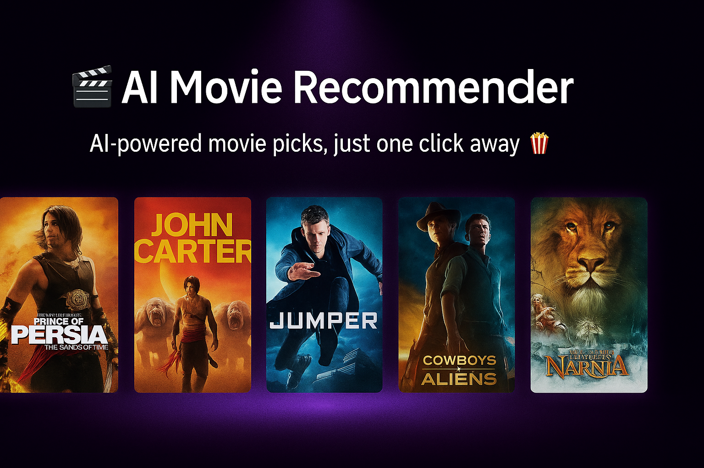

<!-- Banner Image -->
<p align="center">
  
</p>

<h1 align="center">🎬 AI Movie Recommender System</h1>

<p align="center">
  <b>Your next favorite movie, picked by AI.</b><br>
  A visually stunning, content-based movie recommendation app using TMDb and Streamlit.
</p>

<p align="center">
  <a href="https://github.com/your-username/movie-recommender">
    
  </a>
  <a href="https://streamlit.io">
    
  </a>
</p>

---

## 🧠 Overview

The **AI Movie Recommender** suggests the **top 5 similar movies** based on your selection using a **content-based filtering approach**. The app features **real-time poster previews**, a **dark-themed modern UI**, and **smooth animations** for an immersive experience.

---

## ✨ Features

- 🎯 Recommends **5 similar movies** instantly
- 🔍 Fast & searchable movie dropdown
- 🧠 Uses **cosine similarity** on movie features
- 🎞️ Posters fetched live from **TMDb API**
- 🌑 **Dark theme** with smooth **CSS animations**
- ⚡ Deployable on **Streamlit Cloud** for free

---

## 📸 Demo

Check out the live version here (if deployed):

> 🔗 [Live App on Streamlit Cloud](https://your-streamlit-url.streamlit.app)

---

## 🛠 Tech Stack

| Tool        | Description                          |
|-------------|--------------------------------------|
| **Python**  | Core language for logic              |
| **Pandas**  | Data handling and preprocessing      |
| **Pickle**  | Storing movie list & similarity matrix |
| **Streamlit** | Frontend and interactivity        |
| **TMDb API** | Posters and movie metadata          |
| **CSS**     | Custom UI styling and animations     |

---

## 📁 Project Structure

movie-recommender/
├── app.py
├── model/
│ ├── movie_list.pkl
│ └── similarity.pkl
├── banner.png
├── requirements.txt
└── .streamlit/
└── secrets.toml


## ⚙️ Installation

Follow these steps to run it locally:

### 1. Clone the Repository


git clone https://github.com/sentaamil/movie-recommender.git
cd movie-recommender
2. Install Requirements

pip install -r requirements.txt
3. Setup API Key (TMDb)
Create a .streamlit/secrets.toml file:


TMDB_API_KEY = "your_tmdb_api_key_here"
You can get a free TMDb API key from: https://www.themoviedb.org/settings/api

4. Run the App

streamlit run app.py
☁️ Deploy on Streamlit Cloud
Push this project to your GitHub

Go to https://streamlit.io/cloud

Click “New App”, connect your repo

Set app.py as the main file

In the Secrets tab, add:

TMDB_API_KEY = your_tmdb_api_key_here
🚀 Deploy and share your app!

🚀 Example Output

🤝 Contributing
Contributions are welcome! Feel free to open issues or PRs for improvements.

🙏 Acknowledgements
TMDb – for movie metadata and poster API

Streamlit – for rapid web app development

OpenAI – for brainstorming logic ✨

📄 License
This project is licensed under the MIT License.
Feel free to use, modify, and share.

<p align="center"> <b>Made with ❤️ by [Your Name]</b><br> <a href="https://github.com/sentaamil/movie-recommender">github.com/sentaamil</a> </p> ```